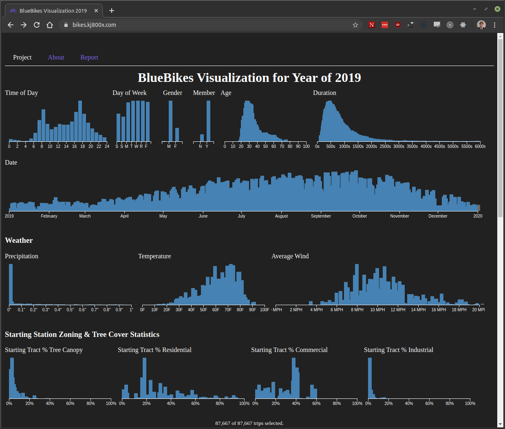
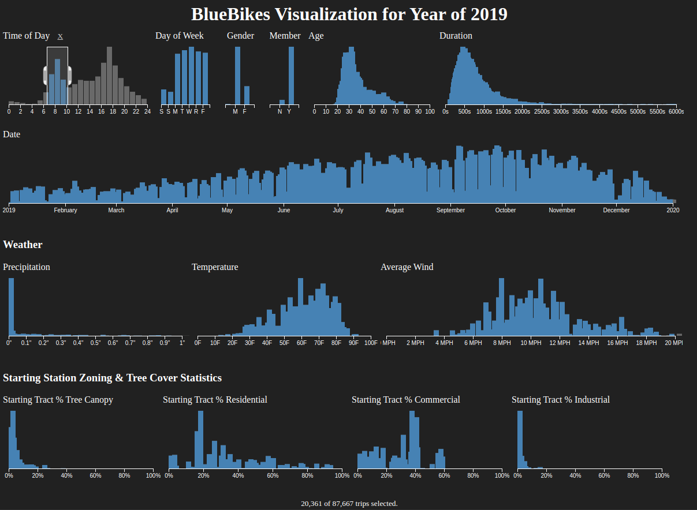
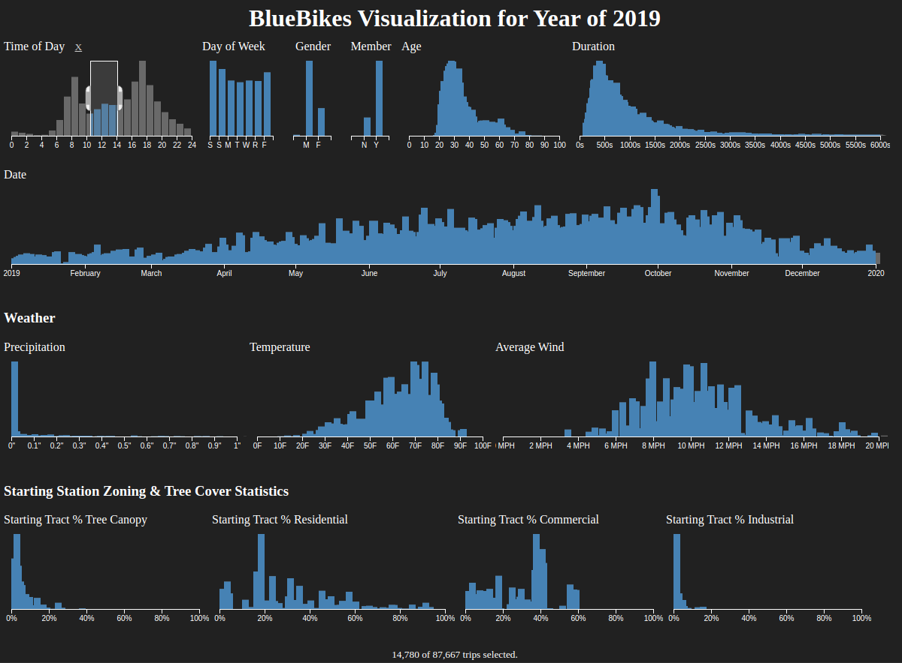

# Introduction

As an avid cyclist myself, I was originally motivated to see what the City of Boston can do to encourage people to use cycling as their form of transportation over alternatives. Cycling usage can be seen as a self-reinforcing cycle, where more cyclists lead to increased investment in cycling infrastructure, which drives more people to chose to cycle. By identifying features of an area which drive people to chose to cycle as their mode of transportation, the city can work to highlight and improve these features.

Which of the features are associated with increased ridership will likely not be novel: the fact that warmer temperatures are associated with increased ridership does not reveal new insights. What I hope to bring to the table is a discussion on the relative priorities of these features. For example, is `tree cover %` or `residential zoning %` a greater influencer on ridership? The results of this question can help set priorities for government officials who are interested in promoting healthier transportation options.

To answer these questions, I have developed [a tool](https://bikes.kj800x.com/) which complies and aggregates information about all of the trips that were taken in 2019. For each trip, I have augmented it with the weather report for that day along with census tract statistics about the starting station's area. This tool is available online for anyone to use and explore the data on their own. By allowing users to explore the data on their own, my conclusions are easily repeatable and verifiable. The tool is currently available online at [https://bikes.kj800x.com/](https://bikes.kj800x.com/).

## Research Questions

When designing my tool, I first considered the types of questions that I would want to be able to use it to explore and answer:

- Do people bike more in areas with more tree coverage?
- Does the weather affect whether or not people ride and does it adversely affect certain groups more?
- Are commuters a notable portion of the BlueBikes user base?
- Are there trends in when people are leaving residential zones vs commercial zones?
- Are there notable changes in the Rider Age or Duration distribution in winter months?

To this end, I consider myself successful in developing such a tool.

## Prior Art

In developing this tool, I sampled other ways that people had explored this data. 

- [This report](https://datascienceplus.com/blue-bikes-sharing-in-boston/) explored the BlueBikes data
- [This app](https://urbandatacyclist.com/2018/11/23/bostons-bluebikes-data-exploration-tool/) shows the demand for bikes by station, along with frequently traveled bike start/end station pairs.
- [This article](https://www.chaossearch.io/blog/blue-bikes-data-dive-part-1) focused on the outliers of the BlueBikes Usage Date. This is interesting and they take it in a direction that my tool wouldn't be able to demonstrate, I'm focusing more on the changes to other variable distributions when other distributions vary.
- [This uncompleted proposal](https://github.com/raghavp96/bluebikedata) is focusing on the availability of the stations over time. While this is an aspect I would have liked to explore, BlueBikes does not provide historical information on station availability, so I would have to collect this data myself in real time using their real time APIs, and I simply didn't have the time to do that. 
- [This app](https://www.visualization.bike/bluebikes/system) allows users to dive into the data and actually integrates weather data (in the form of rainy or sunny days), just like I am planning on. Still, this data doesn't allow you to filter on dimensions other than the day.

## Unique Value

My tool provides unique value in multiple facets. Mainly, the tool is an unopinionated visualizer for the data. I allow users to filter the data in whatever way they want to answer their own research questions. All of the prior art I explored were limited in the way that they could explore the data. Additionally, my tool integrates census tract, zoning, weather, and tree cover information for each trip, which are dimensions that most of the prior art didn't include.

Additionally, as part of creating this tool, I created a set of utility scripts to fetch and process the Boston zoning data, which was not previously in an accessible format. [These scripts](https://github.com/kj800x/bostonography-final/tree/master/data) were made available on GitHub.

# Methods

## Data Acquisition

A significant portion of this project was integrating data from a large number of sources to compile a fully augmented trips file. The raw trips file provided by BlueBikes did not include most of the information that I needed to use to answer my research questions. Most of these sources of data were initially incompatible, and only through temporal and geographic correlations was I able to generate the complete trips file.

### Bluebikes Usage Data

The fundamental dataset that I used was the [BlueBikes Usage Data](https://www.bluebikes.com/system-data), provided by the BlueBikes team. Critical to any analysis about cycling in Boston, the BlueBikes usage data has detailed information about each individual trip taken within the BlueBikes network. This includes information about the starting and ending station, duration, start and end time, rider demographics and other data. By pulling in additional data sources, I can add weather and census tract statistics to this dataset, which is what the web application eventually explores.

The window of time that I have chosen to include is the year of 2019. This is the most recent complete year which will allow us to see differences between different seasons. I have chosen not to do a March 2019 - March 2020 analysis, as I fear that COVID-19 could skew the results for recent months, and I think the visual presentation is stronger if I begin and end on a year boundary, since the most interesting data is likely in the summer.

A major failing of this data is the lack of a codebook paired with coded data. For example, `gender` is either `0`, `1`, or `2`, with no explanation as to what those values correspond to. Based on consensus with other people who have used this data, it seems like `0` is `chose not to share`, `1` is `male`, and `2` is `female`, but this is just an educated guess.

### Census Tracts

In order to make sense of the other datasets, I needed a way to group my other data sources (zoning, tree cover) into logical regions. These logical regions that I chose were the [2010 Census Tracts](https://data.boston.gov/dataset/census-2010-tracts). This data is provided by the Analytics Team at Boston Maps. This dataset defines the geography of the different census tracts within the City of Boston. On it's own, this data does not provide me much, but by aggregating different data sources into each census tract I will be able to do a more powerful comparison.

For example, using the census tracts, we can run an aggregation which takes all the buildings in Boston and determines what percentage each census tract is residential versus commercial. Then we can look up which tract a given BlueBikes station is in to tie the `residential zoning %` of the tract to the station.

### Bluebikes Station Data

Important for correlating the usage data with census tracts, the [station lookup table](https://s3.amazonaws.com/hubway-data/index.html) `current_bluebikes_stations.csv` is provided by [the BlueBikes company](https://www.bluebikes.com/system-data) and includes the latitude and longitude for each station. I have done additional processing on this data to identify the census tract containing each station.

### Boston Zoning Data

One feature of census tracts that I was interested in correlating with BlueBikes usage was the type of buildings in the region surrounding the station. A research question for me was whether the amount a given station was located in a residential vs commercial zone affected other attributes (`time of day`, `duration`) in the BlueBikes usage data.

This data was harder to acquire, as it was not already in an easily accessible form such as JSON or CSV. Instead, the City of Boston hosts an [ArcGIS server](http://mapservices.bostonredevelopmentauthority.org/arcgis/rest/services/Maps/Bos_Zoning_LU/MapServer) which includes a database with the geometry and zoning of each building. I wrote a script which manually downloaded each building and zoning region from the ArcGIS server and wrote it out to a CSV file for further processing. Since this data was difficult to acquire, I have made the data acquisition scripts that I have written available on GitHub, along with the rest of this project.

To actually process this data after downloading the raw building zones and geometries, I took the midpoint of each building and determined the tract that the midpoint was in. This gave me a tract id for each building. Then I aggregated all of the buildings in each tract based on whether the building was residential, commercial, or industrial, and weighted those results by the land area footprint of the buildings. This gave me a percentage of the amount of land which was used for residential vs commercial vs industrial buildings per census tract.

### Tree Canopy Data

The [tree canopy data](https://worldmap.harvard.edu/data/geonode:tree_canopy_fraction_census_tracts_wa8) provided by BARI has information on the tree cover by census tract. I downloaded this data in GeoJSON format, and the data was almost in the correct format. Since the census tract IDs that BARI used were different from the ones I was aggregating with, I had to re-correlate the ids based on the tract geometries. To do this, I simply took the midpoint of each census tract provided by BARI and compared with the 2010 Census Tract dataset I was using. I was able to re-key the BARI tree canopy census tracts in this way so that they could be used with the rest of my data.

### NOAA Weather Data

One suggestion that I was given was to see if there were correlations between weather data and ridership. Initially, I didn't consider this worth the time investment, since it seemed unlikely that the weather results could help to inform public policy, but [NOAA had the data](https://www.ncdc.noaa.gov/cdo-web/orders?email=johnson.kevi@husky.neu.edu&id=2101904) available in the exact format I needed. I was able to request a CSV of the Logan Airport weather station daily averages for temperature, wind speed, precipitation, and snow. I correlated this with the trip data temporally, based on the day each trip was taken.

### Aggregation

The process for using these different data sources to build the complete trip file happens in multiple steps. First, I downloaded many of the original source datasets and organized them into folders. Then I wrote the [`data/src/scrapeZoning.js`](https://github.com/kj800x/bostonography-final/blob/master/data/src/scrapeZoning.js) script which downloads the data from the Boston Zoning ArcGIS server, and outputs the results into a CSV file. This is a long process and I don't want to repeatedly overwhelm the Zoning server, so I designed it to be a separate script which must be run first.

Finally, I have the [`data/src/concatBikes.js`](https://github.com/kj800x/bostonography-final/blob/master/data/src/concatBikes.js) script which first reads in the raw trips file for each month, augments the trip with the census tract level information generated with `scrapeZoning.js`, and then does some custom compression on the results before finally generating a [`trips.json`](https://bikes.kj800x.com/trips.json) file. This file is our completely and minified augmented trips file which we provide as data to the web application visualization tool. In order to decrease load times, the keys and headers for each row are removed and reconstructed [on the frontend](https://github.com/kj800x/bostonography-final/blob/master/site/visualizer.js#L6-L22).

## Tool Design

When exploring ideas on ways to explore this data, my coworker mentioned to me that he had done a similar project doing a multidimensional analysis using the [Crossfilter](https://github.com/crossfilter/crossfilter) library. After checking out some examples, I decided that this library would do an excellent job at showing changes in distribution shapes while varying parameters. Essentially, the library would allow me to do a visual version of a regression analysis. Initially, I was simply going to run a regression analysis on my data in R, but I decided that developing this tool and publishing it on my personal website would be more representative of the type of work I want to highlight on my personal website and GitHub.

I wrote some custom code to allow me to decompress the trip file and some scaffolding logic to mate the Crossfilter dimensional filtering with the [D3.js](https://d3js.org) library to generate visual bar charts. An initial version of the tool was able to be completed rapidly, but adding in the final features such as including the graph for station tract's tree cover, adjusting the layout, and enhancing the axis logic for the graphs to allow for proper axis labels for non-numerical data (such as day of week) took the final week of classes to get right. In the end, the tool was able to be completed satisfactorily.

## Tool Usage

Upon loading the webpage for the tool, the data will load into your browser. This previously took around ten seconds, but due to some data minimization techniques, it only takes around two seconds now. I have also now added a loading screen so the user isn't confused for those two seconds, because based on prior feedback some users thought the tool was broken when it was just loading.

Once the data loads, the user will see a total of 14 different graphs, showing a total of tens of thousands of trips taken over the course of the year. By clicking and dragging to select a region of a graph, all other graphs will automatically update themselves to reflect the proper subset. In this way, the application keeps all graphs in sync at the same time. To remove a filter, you can click on the region outside of the selection for a particular graph, or simple click the `X` which appears next to the graph title.

The real value of this application is to watch what happens to the distributions of the other graphs when you drag the selection window. For example, if you wanted to investigate the relationship between `time of day` and `day of week`, you could create a filter window on `time of day` of a few hours. Then watch what happens to the `day of week` distribution as `time of day` is changed. In this case, you would see that when `time of day` is in the morning or the evening, `day of week` is dominated by the weekdays. During the middle of the day, `day of week` is dominated by the weekends.

## Tool Value

The tool can provide value to a diverse set of people. BlueBikes staff and city planners can benefit from the tool by exploring the characteristics of neighborhoods where BlueBikes has been historically successful. The zoning information is an example of neighborhood-level statistics which this tool can explore. There is potential for this tool to be revised to potentially include other datasets of interest, and this tool can serve as a proof-of-concept that such a tool can be easily and rapidly developed. Understanding these characteristics of a successful BlueBikes neighborhood can help determine the value of future BlueBikes stations. For example, city planners can use the information they learn from this tool to guide their decisions to accept or reject proposals to new BlueBikes stations. An interested person could filter the existing data to match the characteristics of a proposed station to explore the ridership that the station would expect to see over time.

## Privacy

This project strives to respect the privacy of those represented by the datasets. Most of the data is aggregated on a census-tract level. The trip data is provided on an individual trip level, but it is provided by BlueBikes anonymized, and my tool provides an even smaller subset of the data that BlueBikes provides. It would be extremely difficult or impossible to identify the trips taken by a particular person.

## Further Improvements

Although the tool is successful and effective, I believe there are potential areas for improvement.

I would have liked to have also included a heatmap view of trips overlaid upon a geographical map of Boston. I think this would have been a compelling visualization which I wasn't able to include.

I would have liked to include a visual representation of the mean and standard deviation on top of the graphs. This would have enhanced the ability of the tool to demonstrate changes in distribution shape.

The precipitation dimension isn't particularly useful as-is, because it is dominated by days with no precipitation. I think it might have made more sense to consider that dimension as a boolean where it either did rain or didn't rain on a particular day.

Percent canopy wasn't as useful as I had expected, but it seems like this might be due to the BARI data I have, or mainly because of the fact that there actually isn't as much variation on tree cover between the different tracts of Boston

Percent industrial and commercial (to a lesser degree) are also less valuable dimensions, since Boston has a smaller variability among them.

Although I have uniformly sampled the data so that the tool will load into most user's browsers fast, certain users might be interested in an un-sampled or an alternate sampling percentage version of the data. I would like to be able to offer this alternate dataset to them easily.

# Conclusions

The development of the tool was a success. Aside from the motivating question which was too broad to be answered by single tool, all of my research questions were able to be answered by my end result. I believe I have expanded upon previous analyses of this data and built a tool which can answer arbitrary questions about the data.